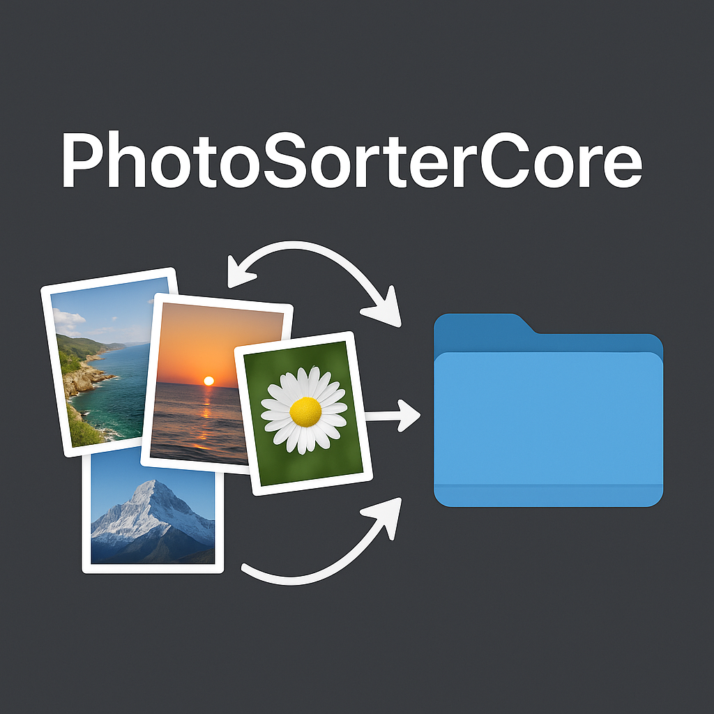

<div align="center">
  
  
  <h1>PhotoSorterCore</h1>
  
  <p>
    <strong>Мощная Swift библиотека для организации, сортировки и управления коллекциями фото и видео на macOS</strong>
  </p>
  
  <p>
    <a href="#возможности">Возможности</a> •
    <a href="#установка">Установка</a> •
    <a href="#быстрый-старт">Быстрый старт</a> •
    <a href="Docs/">Документация</a>
  </p>
  
  <p>
    
    
    
    
    
  </p>
  
  <p>
    <a href="README.md">English version</a>
  </p>
</div>

---

PhotoSorterCore предоставляет полный функционал для работы с метаданными, исправления дат, конвертации форматов и интеллектуальной организации файлов.

## Возможности

- **Умная сортировка фото и видео** - Автоматическая организация медиафайлов по датам в структурированную иерархию папок (Год/Месяц)
- **Управление метаданными** - Извлечение и исправление EXIF/метаданных с датами из фотографий и видео
- **Конвертация форматов** - Конвертация PNG и DNG файлов в формат HEIC с сохранением качества
- **Инструменты исправления дат** - Исправление неверных или отсутствующих дат в метаданных файлов
- **Гибкое переименование** - Переименование файлов с настраиваемыми паттернами формата даты
- **Пакетная обработка** - Обработка целых папок с отслеживанием прогресса и обработкой ошибок
- **Security-Scoped Resources** - Полная поддержка песочницы macOS и security-scoped URL

## Требования

- macOS 15.0+
- Swift 6.0+
- Xcode 16.0+

## Установка

### Swift Package Manager

Добавьте PhotoSorterCore в ваш `Package.swift`:

```swift
dependencies: [
    .package(url: "https://github.com/yourusername/PhotoSorterCore.git", from: "1.0.0")
]
```

Или добавьте через Xcode:
1. File → Add Package Dependencies
2. Введите URL репозитория
3. Выберите версию и добавьте в ваш таргет

## Быстрый старт

### Базовая сортировка фотографий

```swift
import PhotoSorterCore

// Настройка сортировщика
let config = SorterEngine.Configure(
    inputFolder: inputURL,
    outputFolder: outputURL,
    options: [.createFolders, .renameFiles],
    dateFormat: "YYYY-MM-DD HH-mm"
)

// Создание и запуск сортировщика
let sorter = SorterEngine(configure: config)

let result = try await sorter.run(
    progressHandler: { progress in
        switch progress {
        case .started:
            print("Сортировка началась...")
        case .fileProcessed(let source, let target):
            print("Обработан: \(source) → \(target)")
        case .completed(let count):
            print("Завершено! Обработано \(count) файлов")
        default:
            break
        }
    },
    errorHandler: { error in
        print("Ошибка: \(error)")
    }
)
```

### Конвертация изображений в HEIC

```swift
import PhotoSorterCore

let converter = UnifiedConvertManager()

await converter.convertToHEIC(
    from: .png,  // или .dng
    folderURL: folderURL,
    deleteOriginalFile: false,
    stateHandler: { state in
        print("Состояние конвертации: \(state)")
    }
)
```

### Исправление дат в метаданных файлов

```swift
import PhotoSorterCore

let fixDateTool = FixDateTool()

// Исправление дат путем извлечения из метаданных
try fixDateTool.fixDatesIn(folderURL: folderURL) { error in
    print("Ошибка исправления даты: \(error)")
}

// Или установка конкретной даты для всех файлов
try fixDateTool.forceSetDate(
    with: specificDate,
    forFolder: folderURL
) { error in
    print("Ошибка установки даты: \(error)")
}
```

## Основные компоненты

### SorterEngine
Основной движок для сортировки и организации медиафайлов. Поддерживает несколько опций:
- `createFolders` - Создание структуры папок Год/Месяц
- `renameFiles` - Переименование файлов с форматом даты
- `fixMetadata` - Исправление метаданных файлов во время сортировки
- `forceUpdateDate` - Установка конкретной даты для всех файлов

### UnifiedConvertManager
Универсальный конвертер форматов изображений с поддержкой:
- Конвертация PNG в HEIC
- Конвертация DNG (RAW) в HEIC
- Сохранение атрибутов и метаданных файлов
- Настраиваемые параметры качества

### FixDateTool
Продвинутый функционал исправления дат:
- Извлечение минимальной даты из всех полей метаданных
- Исправление EXIF/метаданных дат
- Установка дат создания контента
- Поддержка фотографий и видео

## Документация

Для подробной документации, примеров и расширенного использования:

- [API Документация](Docs/) - Полный справочник API
- [Примеры](Docs/EXAMPLES.md) - Примеры кода и сценарии использования
- [Руководство по миграции](Docs/MIGRATION_GUIDE.md) - Обновление со старых версий
- [История изменений](Docs/CHANGELOG.md) - История версий и изменения

## Обработка ошибок

PhotoSorterCore предоставляет комплексную обработку ошибок с детальными типами ошибок:

```swift
do {
    let result = try await sorter.run(
        progressHandler: { progress in },
        errorHandler: { error in
            // Обработка некритичных ошибок обработки файлов
            switch error {
            case .invalidDate(let path, let date):
                print("Неверная дата в \(path): \(date)")
            case .moveFailed(let source, let destination, let reason):
                print("Не удалось переместить: \(reason)")
            default:
                print("Ошибка обработки: \(error)")
            }
        }
    )
} catch let error as SorterError {
    // Обработка критических ошибок
    switch error {
    case .permissionDenied:
        print("Доступ запрещен")
    case .folderNotAccessible(let path):
        print("Не удается получить доступ к папке: \(path)")
    case .cancelled:
        print("Операция отменена")
    }
}
```

## Тестирование

PhotoSorterCore включает полное покрытие тестами с поддержкой dependency injection:

```swift
// Все основные компоненты поддерживают dependency injection для тестирования
let mockDateExtractor = MockDateExtractor()
let mockCommandExecutor = MockSystemCommandExecutor()

let fixDateTool = FixDateTool(
    dateExtractor: mockDateExtractor,
    commandExecutor: mockCommandExecutor
)
```

Запуск тестов:
```bash
swift test
```

## Вклад в проект

Приветствуются любые вклады! Пожалуйста, не стесняйтесь отправлять Pull Request.

## Лицензия

PhotoSorterCore распространяется по лицензии MIT.

## Автор

Andrey Torlopov — torlopov.mail@ya.ru

## Поддержка

Для сообщений об ошибках и запросов функций, пожалуйста, создайте issue на GitHub.
